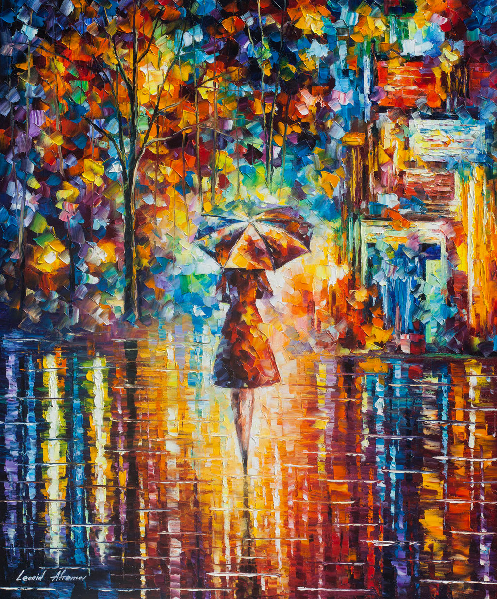
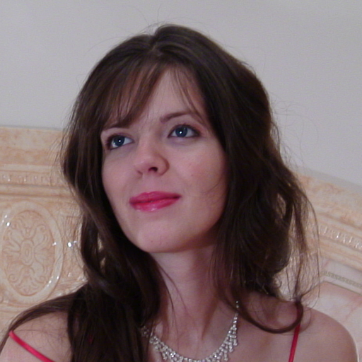
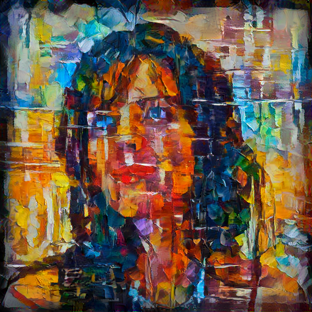
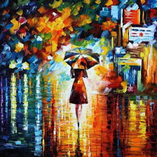
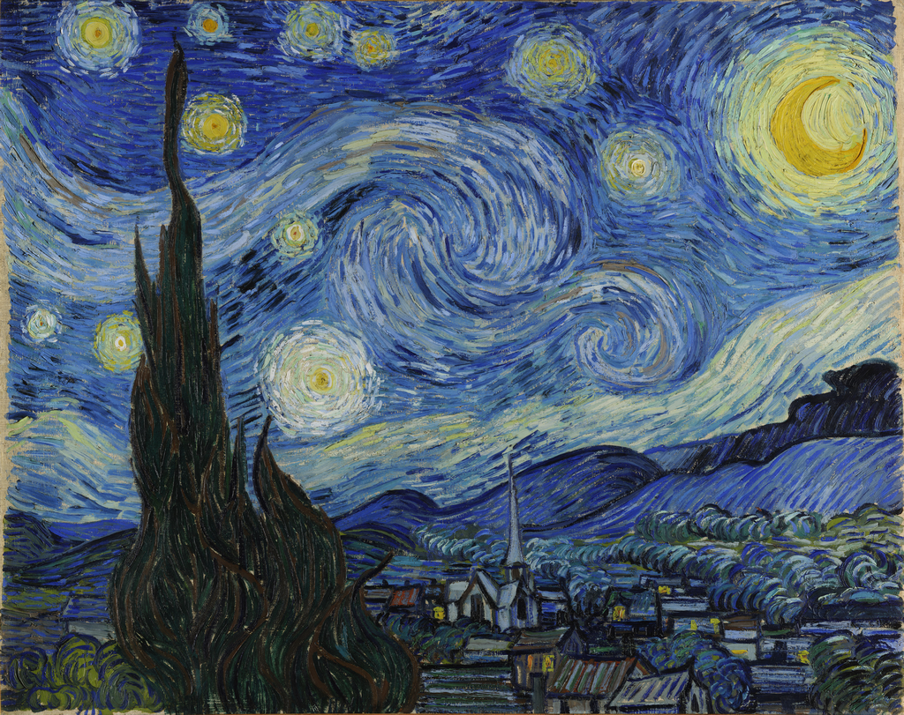
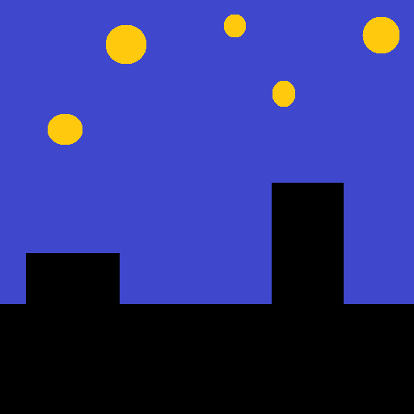
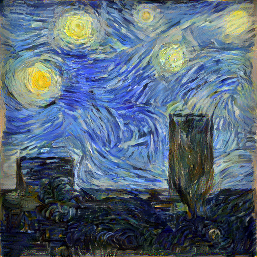

# style-transfer
This is an efficient implementation of [neural style transfer](https://arxiv.org/abs/1508.06576) in Tensorflow, adding some tweaks of my own.
## Prerequisites
* Tensorflow (tested on 1.4)
* The VGG-19 network from [this](https://github.com/tensorflow/models/tree/master/research/slim) page.
## Getting started
* Download files to a local folder
* Install Python 3.6 from [here](https://www.python.org/downloads/)
  * Windows users use [64-bit version](https://www.python.org/downloads/windows/)
* [Install Tensorflow](https://www.tensorflow.org/install/) (GPU version recommended if you have an nvidia GPU)
* Extract the [file](http://download.tensorflow.org/models/vgg_19_2016_08_28.tar.gz) containing VGG-19 
* Edit style-transfer.py to point the ```path_to_vgg19``` variable to ```vgg_19.ckpt``` from the above file
* You can change the style and content image used by changing the ```content_image``` and ```style_image``` parameters of the ```transferStyle``` function
* You can run the script by running ```python3 style-transfer.py``` from the command line
  * This will produce ```result.png``` with the same resolution as the content image

## Parameters
* The ```tv_loss``` parameter controls the amount of *smoothing* applied during style transfer. Setting this to 0 can produce more ringing artefacts
* The ```content_loss``` parameter controls how strongly the contents of the *content image* should be enforced.
* The ```maxiter``` parameter of the optimizer controls the maximum number of iterations to run. More iterations generally mean higher quality. For best results set this to a high number (e.g. 50000) and let the optimizer run until convergence (which should happen before 50000 iterations are reached)
* The ```maxcor``` parameter controls the amount of information tracked by the L-BFGS optimizer about the curvature of the function being minimized. A higher number should mean a higher quality output, but also results in slower iteration time (The optimizer runs on the CPU)

## Additional style transfer tweaks used
* Added total variation loss used in some other implementations
* As the ReLU activation sets negative values to zero, the inputs of the ReLUs were used to construct the Gram matrix
* Added *x* and *y* gradients of feature maps to Gram matrix generation for richer style representation
* More equal balancing of style loss gradients

### Effects of feature gradients on style representations
It's possible to make style representations obtaned from the style image richer by also including the horizontal and vertical gradients of the activation tensors in the Gram matrix. The following line reads in the activation tensor:
```
activations = getLayer(layer)
```
The following 2 lines calculate the *x* and *y* gradients of the feature maps:
```
activationsX = activations[:, 1:, 1:, :] - activations[:, :-1, 1:, :]
activationsY = activations[:, 1:, 1:, :] - activations[:, 1:, :-1, :]
```
Which is equivalent to convolving the feature maps by the [-1, 1] convolution kernel horizontally and vertically. Then these features are concatenated with the original activations to effectively triple the number of features available to construct the Gram matrix:
```
activations = tf.concat([activations[:, 1:, 1:, :], activationsX, activationsY], 3)
```
This results in a more consistent representation of style
#### Without feature gradients

#### With feature gradients


## Balancing style gradients during minimization
The original style loss in  is defined as follows:


This function has some downsides from an optimization perspective: The magnitude of gradients of the style loss from each activation layer differ significantly during optimization, requiring hand-tuned weights for each layer. But even hand tuned weights can't prevent the relative magnitude of the gradients changing during the optimization. To fix this the following formula is proposed to normalize the "dynamic range" of the gradients:


Where α>1 is a parameter that controls how much the gradients' magnitudes are brought together (A value of 10000 works well

## Gram matrix normalization

The original paper proposes the following normalization of the Gram matrix:


This seems to have problems when the dimensions of the style and content images significantly differs. To make the Gram matrix resolution-invariant the following normalization is used, where ||G||<sub>F</sub> is the [Frobenius norm](https://en.wikipedia.org/wiki/Matrix_norm#Frobenius_norm) of G:


## Examples
Using the following image as the style image:

<p align="center">
  
</p>

And this one as the content image:

<p align="center">
  
</p>

Produces:

<p align="center">
  
</p>

### Transferring style

In the following example all but the style loss have been turned off. The result is a close reproduction of the style image, only from the (enhanced) Gram matrix:

    

### Starting from "sketch"

Using a classic Van Gogh painting:
<p align="center">
  
</p>
And a simple sketch:
<p align="center">
  
</p>
Produces a good reconstruction. Notice that the missing paint at the edges of the frame resembles the original:
<p align="center">
  
</p>

## Troubleshooting, tips and tricks
* If you get an "out of memory" error message try to reduce the resolution of the content image
* It's possible that some of the ringing artefacts in the result are produced by JPEG artefacts in the style image. This can be mitigated by using an uncompressed style image, or one that was resized from a jpeg image to a smaller resolution and then saved as an uncompressed image.
* The best way to capture a rich style representation from an image is to find a high resultion version of it, scale it down with a good quality filter to a lower resolution (something around 512 to 1024 pixels on the long side) and save with lossless compression.

## Future work
* Apply loss at multiple levels of an image pyramid
* Arbitrary resolution of the output
